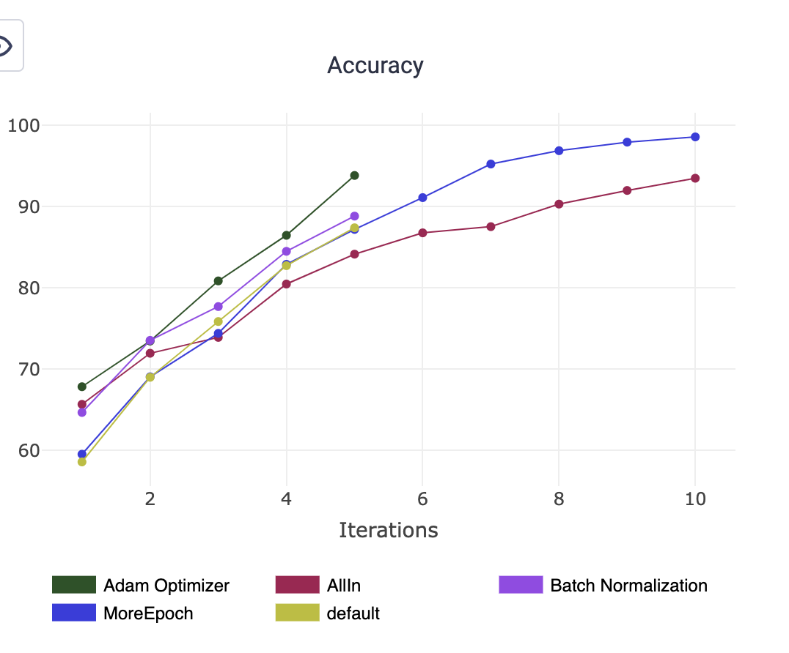
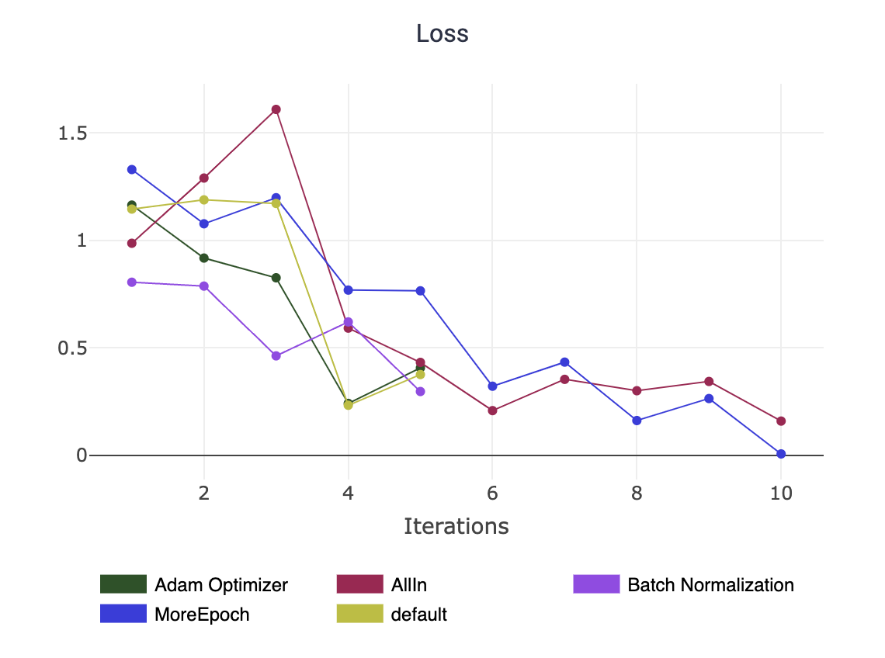
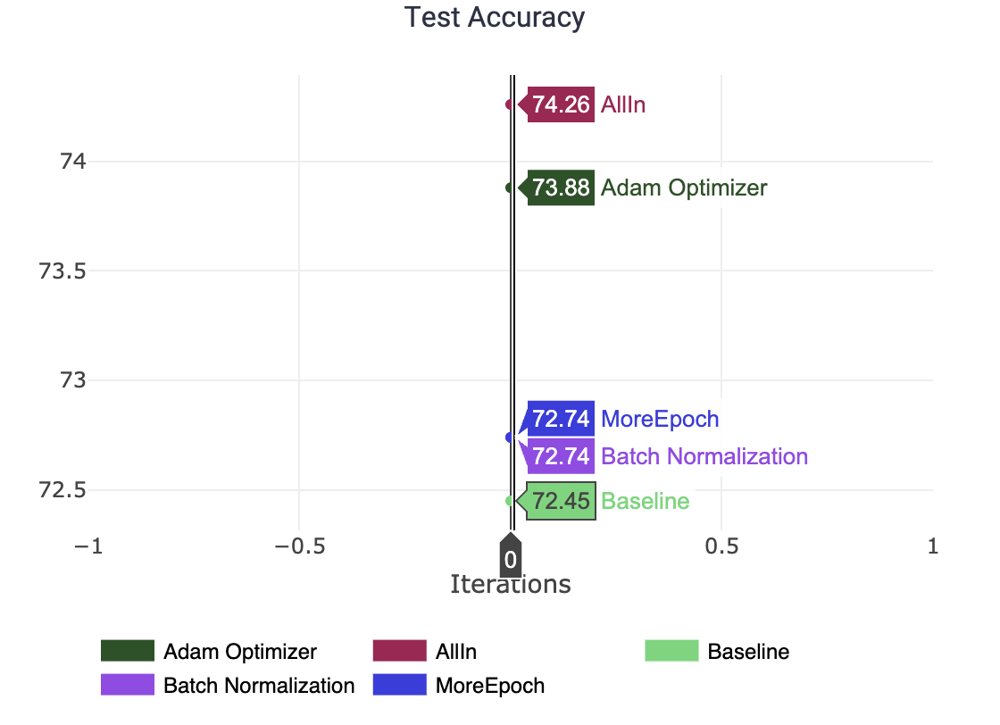

## Лабораторная работа № 2
## Применение инструментов для логгирования  при проведении экспериментов с обучением моделей МО
**Цель работы** - освоить инструменты для логгирования и визуализации метрик модели МО, сформировав 3 гипотезы по улучшению качества ее работы. 

В лабораторной работе решается задача классификации на данных [CIFAR-10](https://www.geeksforgeeks.org/cifar10-dataset-in-keras-tensorflow-for-object-recognition/). В качестве базовой модели была реализована простая сверточная нейорнная сеть. 

### Ход работы: 
- Для логгирования и сравнения результатов экспериментов был выбран фреймоврк ClearML;
- Были сформулированы 3 гипотезы по улучшению качества работы базовой модели: 
    * увеличение количества эпох; 
    * применение Batch Normalization;
    * применение Adam Optimizer;
- Чтобы проверить сформулированные гипотезы, были проведены эксперименты с обучением модели с помощью ClearML.

### Результаты: 
Увеличение количества эпох привело к переобучению модели. Применение Batch Normalization помогло улучшить точность работы модели, но незначительно, что может быть связано с тем, что CIFAR-10 относительно простой датасет. Использование оптимизации Adam привело к наилучшим результатам. Применение всех трех гипотез не дало положительных разультатов из-за переобучения модели. Результаты экспериментов представлены на графиках ниже. 

